##  **PROJECT 5 - CLIENT - SERVER ARCHITECTURE WITH MYSQL**

## STEP 1 – CREATION OF CLIENT AND DATABASE SERVER INSTANCES

### DB-server and client instances created

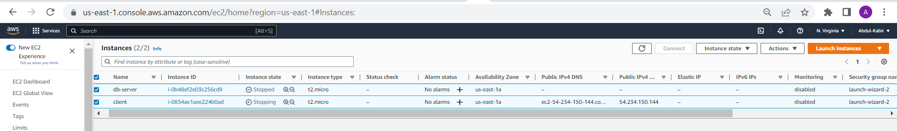

## STEP 2 – MYSQL-SERVER INSTALLATIONS

### mysql-server installation on DB-server

`sudo apt update -y`
`sudo apt install mysql-server -y`

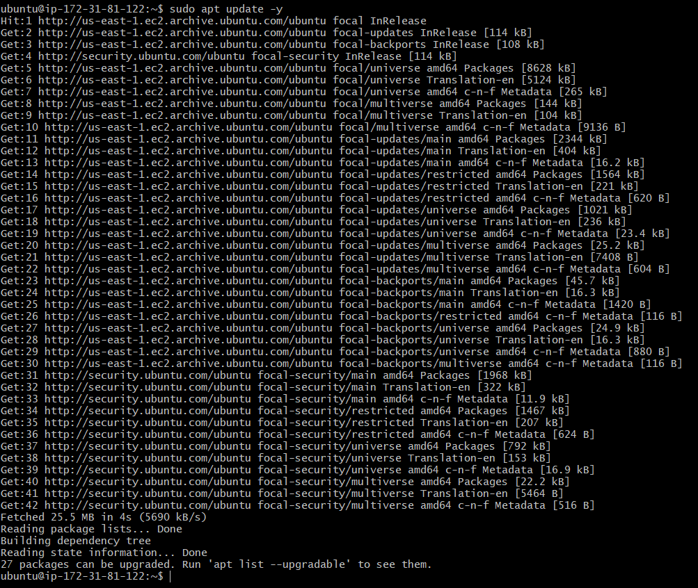
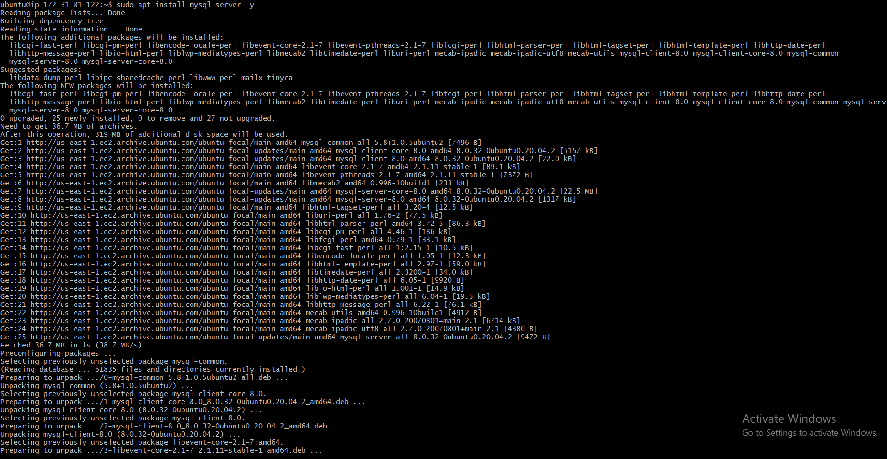
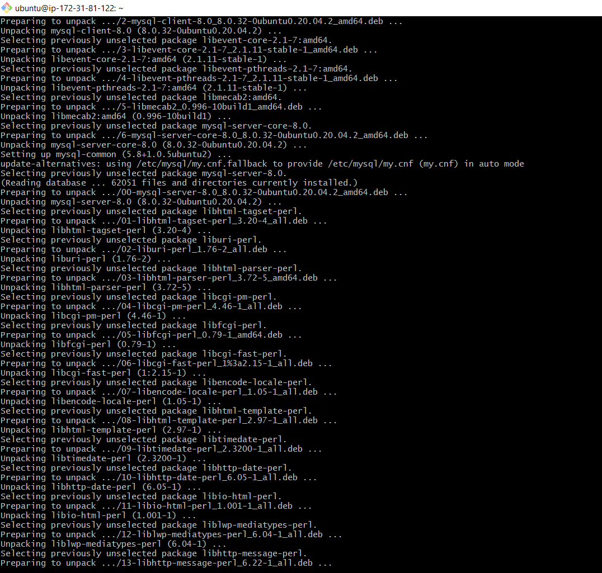
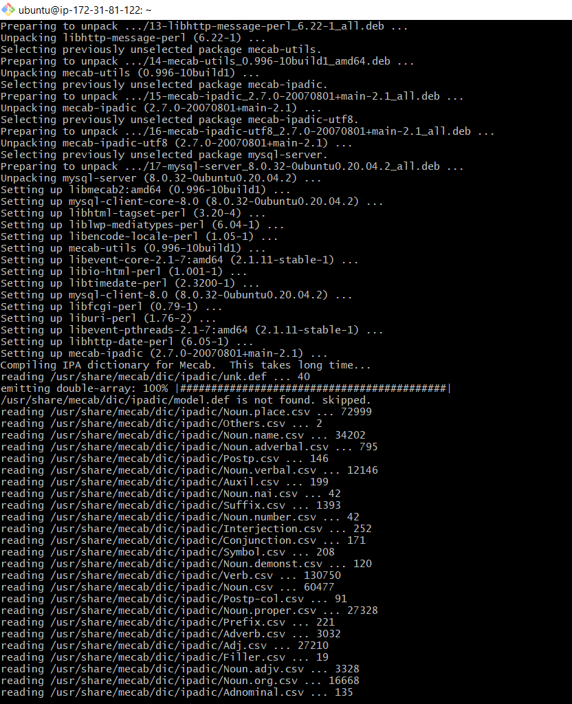
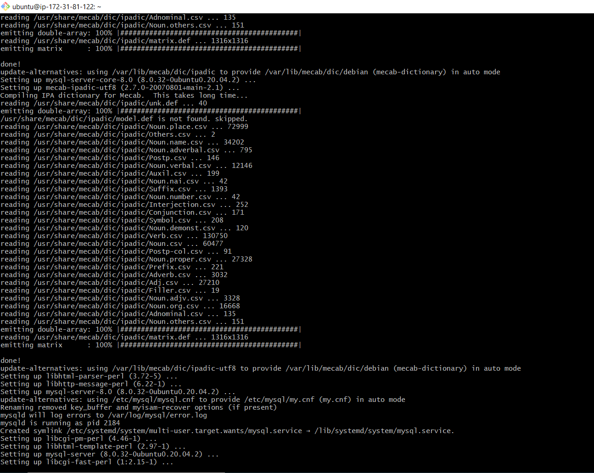
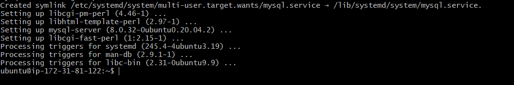

### Enabling mysql service

`sudo systemctl enable mysql`

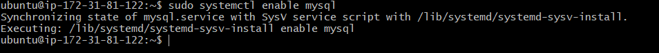

## STEP 3 – CLIENT INSTALLATIONS

### Cient instance updated

`sudo apt update`

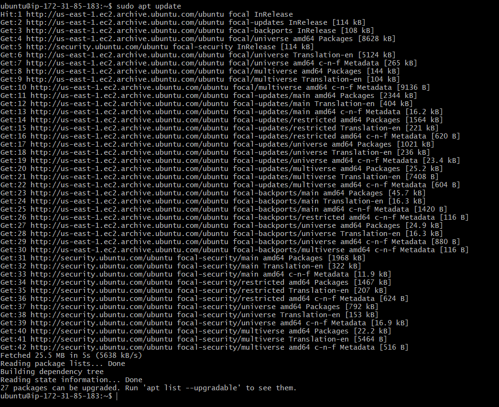

### Installation of mysql-installation

`sudo apt install mysql-client -y`

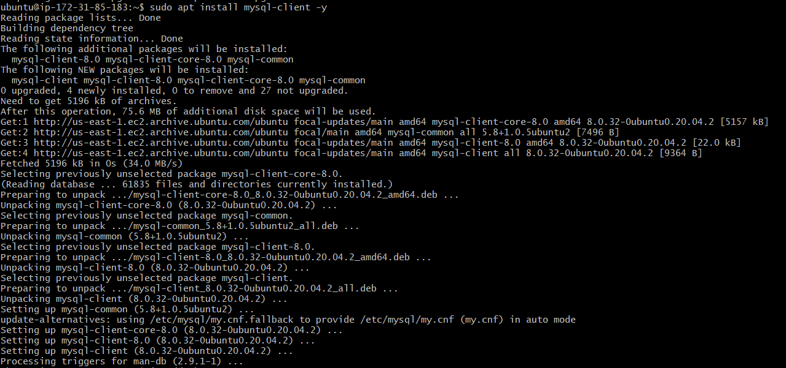

## STEP 4 – SECURITY GROUP TO RESTRICT REMOTE ACCESS TO ONLY CLIENT

### Security group edited

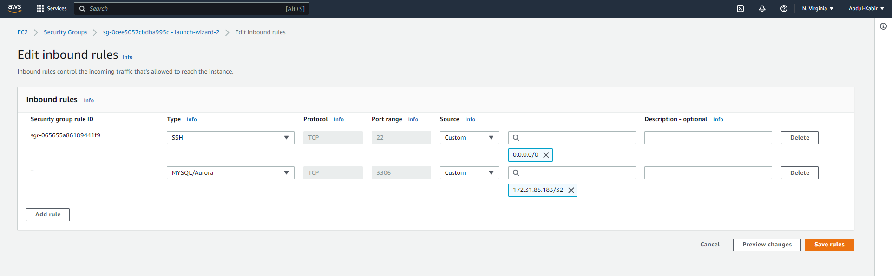

### Security scrip running on mysql-server

`sudo mysql_secure_installation`

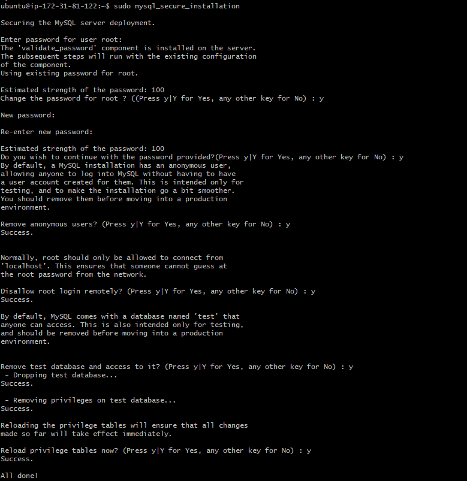

### running mysql

`sudo mysql`

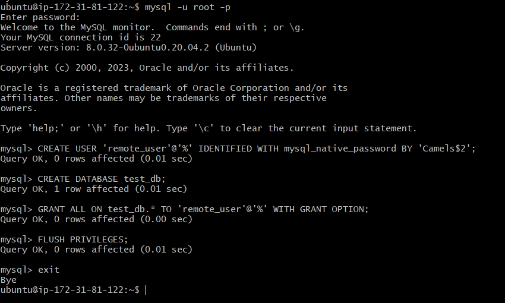

### configuration of mysql-server to allow connections from remote hosts

`sudo vi /etc/mysql.conf.d/mysqld.cnf`

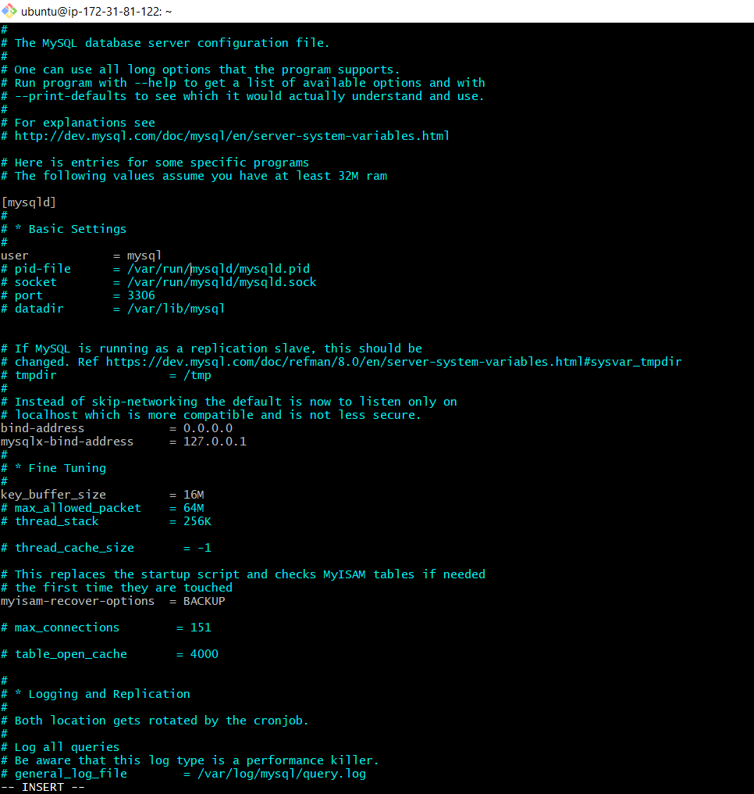

### restarting the service

`sudo systemctl restart mysql`

### conneting remotely to mysql server datbase engine from client using mysql utility

`sudo mmysql -u remote_user -h 172.31.81.122 -p`

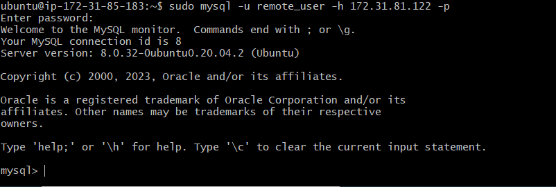

### Lastly, confirm that you have successfully connected to a remote MYSQL server

`show databases`

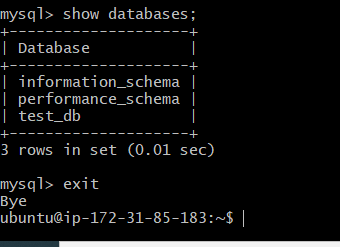

